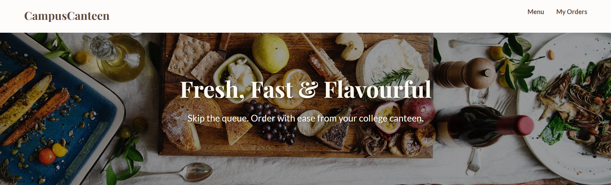
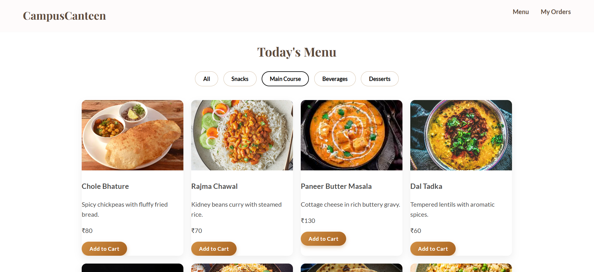
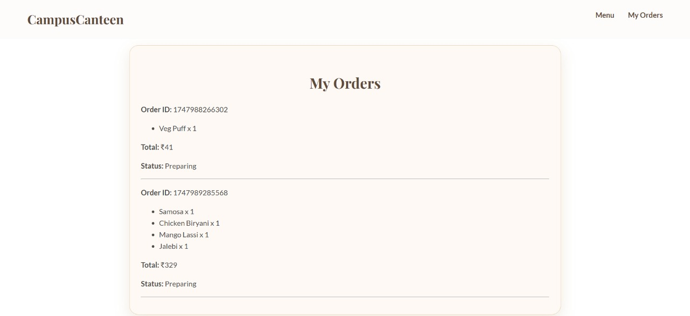

# CampusCanteen UI

A modern, elegant, and culturally inspired **online food ordering interface** designed specifically for college canteens. This frontend-only project focuses on delivering a smooth user experience with an Indian aesthetic touch, enabling students to browse, filter, and add food items to their cart effortlessly.

---

## Features

- **Visually appealing design** with warm, earthy colors reflecting Indian food culture
- **Responsive layout** optimized for desktop, tablet, and mobile devices
- **Category filters** for quick menu browsing
- **Dynamic product cards** with images, descriptions, prices, and stylish "Add to Cart" buttons
- **Sticky navigation bar** with smooth hover effects
- **Fixed shopping cart** displaying selected items and total price
- **Smooth animations** for interactive elements enhancing user engagement

---

## Technologies Used

- HTML5  
- CSS3 (Flexbox, CSS Grid)  
- JavaScript (ES6+)  
- Google Fonts: [Rajdhani](https://fonts.google.com/specimen/Rajdhani), [Poppins](https://fonts.google.com/specimen/Poppins), [Mukta](https://fonts.google.com/specimen/Mukta)  

---

## Usage

1. Clone or download this repository.
2. Open `index.html` in any modern web browser.
3. Browse food items by categories.
4. Click **Add to Cart** to select items.
5. View your cart on the right panel; remove items or proceed to checkout (functionality to be implemented).

---

## Screenshots

  
*Main landing page with hero image and navigation.*

  
*Food item cards with category filters and add to cart buttons.*

  
*Fixed shopping cart displaying selected items.*

---

## Future Enhancements

- Backend integration for real-time menu and order processing  
- User authentication and profile management  
- Payment gateway integration  
- Mobile application version  
- Accessibility improvements  

---

## License

This project is for educational and personal use only.  
Please do not copy or reuse this code for commercial purposes without permission.

---

## Author

**Pree Om Priyadarshi Kamila**  
B.Tech AIML Student, ITER, Siksha ‘O’ Anusandhan DU  
[LinkedIn](https://www.linkedin.com/in/preeom) | [GitHub](https://github.com/preeom)

---

## Acknowledgments

- Design inspiration from Indian culinary culture and warm color palettes  
- Fonts courtesy of Google Fonts  
- Helpful tutorials and resources from MDN Web Docs and CSS-Tricks  

---

Feel free to reach out if you want to collaborate or need help with similar projects!

